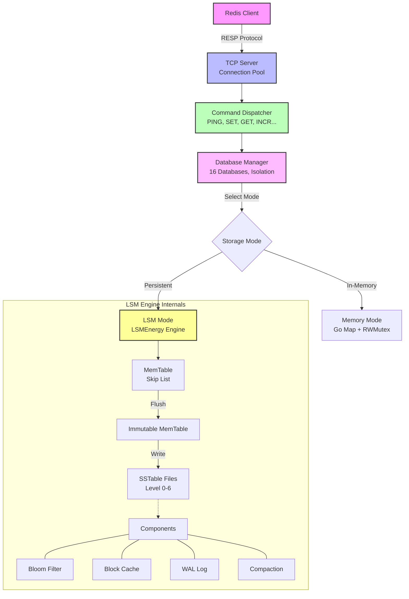

# RediGo - 高性能 Redis 兼容服务器

[!\[Build Status\](https://img.shields.io/badge/build-passing-brightgreen null)]()
[!\[Redis Protocol\](https://img.shields.io/badge/protocol-redis%207.0-blue null)]()
[!\[LSM Tree\](https://img.shields.io/badge/storage-lsm%20tree-green null)]()

## 📖 项目简介

RediGo 是一个使用 Go 语言实现的高性能、Redis 协议兼容的键值存储服务器。支持内存模式和 LSM Tree 持久化模式，提供灵活的数据持久化选项。

### ✨ 核心特性

- ✅ **Redis 协议兼容** - 支持 33+ 个常用 Redis 命令
- ✅ **双模式运行** - 内存模式 / LSM Tree 持久化模式
- ✅ **高性能存储** - LevelDB/RocksDB 风格的 LSM Tree 引擎
- ✅ **并发安全** - 完整的读写锁机制
- ✅ **数据过期** - 支持 TTL/PTTL 精确过期控制
- ✅ **多数据库** - 16 个独立数据库（db\_0 \~ db\_15）
- ✅ **批量操作** - MSET/MGET 原子批量操作
- ✅ **原子增减** - INCR/DECR 原子计数器

***

## 🚀 快速开始

### 安装依赖

```bash
go mod download
```

### 编译项目

```bash
make build
# 或者
go build -o bin/gedis-server cmd/server/main.go
```

### 启动服务器

```bash
./bin/gedis-server
```

### 使用客户端连接

```bash
redis-cli -h 127.0.0.1 -p 16379
```

### 测试连接

```bash
PING
# Output: PONG

SET mykey "Hello RediGo"
GET mykey
# Output: "Hello RediGo"
```

***

## 📦 项目结构

```
RediGo/
├── README.md                 # 主说明文档（本文件）
├── Makefile                  # 构建脚本
├── go.mod                    # Go 模块定义
│
├── cmd/                      # 命令行入口
│   ├── server/              # 服务器入口
│   └── client/              # 客户端入口
│
├── config/                   # 配置管理
│   └── config.go            # 配置定义和加载
│
├── internal/                 # 内部核心包
│   ├── command/             # Redis 命令实现
│   │   └── basic.go         # 基础命令实现
│   │   └── registry.go      # 命令注册表
│   │
│   ├── database/            # 数据库核心
│   │   └── database.go      # 数据库实现
│   │   └── db_manager.go    # 数据库管理器
│   │
│   ├── datastruct/          # 数据结构
│   │   └── data.go          # DataValue 定义
│   │
│   ├── persistence/         # LSM Tree 持久化引擎
│   │   ├── README.md        # 持久化模块详细文档
│   │   ├── lsm_engine.go    # LSM 引擎主逻辑
│   │   ├── memtable.go      # MemTable (跳表)
│   │   ├── sstable.go       # SSTable 读写
│   │   ├── bloom_filter.go  # Bloom Filter
│   │   ├── block_cache.go   # Block Cache (LRU)
│   │   ├── wal.go           # Write-Ahead Logging
│   │   ├── compaction.go    # Compaction 合并
│   │   └── ...              # 其他组件
│   │
│   ├── protocol/            # Redis 协议解析
│   │   └── parser.go        # RESP 协议解析器
│   │
│   └── server/              # 服务器实现
│       └── server.go        # TCP 服务器
│
├── pkg/                      # 公共工具包
│   ├── logger/              # 日志包
│   └── utils/               # 工具函数
│
├── scripts/                  # 辅助脚本
│   └── start.sh             # 启动脚本
│
├── bin/                      # 编译输出（gitignore）
│   └── gedis-server
│
├── data/                     # 数据目录（gitignore）
│   └── db_*/                # 各数据库的 LSM 文件
│
└── logs/                     # 日志目录（gitignore）
    └── server.log
```

***

## 🔧 配置说明

### 配置文件示例

```yaml
# config.yml
server:
  host: "127.0.0.1"
  port: 16379
  
database:
  count: 16  # 数据库数量
  
persistence:
  enabled: true              # 启用持久化
  type: "lsm"                # 持久化类型：memory | lsm
  data_dir: "./data"         # 数据目录
  
  # LSM 专用配置
  mem_table_size: 4MB        # MemTable 大小
  max_mem_tables: 4          # 最大 MemTable 数量
  sstable_size: 10MB         # SSTable 大小
  bloom_filter_bits: 10      # Bloom Filter 位数
  block_cache_size: 100MB    # Block Cache 大小
  max_open_files: 500        # 最大打开文件数
  
  # 冷启动策略
  cold_start_strategy: "lazy_load"  # no_load | load_all | lazy_load
```

### 冷启动策略说明

| 策略           | 配置值         | 说明               | 适用场景        |
| ------------ | ----------- | ---------------- | ----------- |
| **NoLoad**   | `no_load`   | 不加载历史数据（默认）      | 快速启动，作为新实例  |
| **LoadAll**  | `load_all`  | 启动时全量加载到内存       | 小数据量，要求快速读取 |
| **LazyLoad** | `lazy_load` | 懒加载，读取时 fallback | 大数据量，节省内存   |

***

## 📋 支持的 Redis 命令

### 连接测试

- `PING [message]` - 测试服务器连接

### 字符串操作

- `SET key value` - 设置键值
- `GET key` - 获取键值
- `DEL key [key ...]` - 删除键
- `EXISTS key` - 检查键是否存在
- `EXPIRE key seconds` - 设置过期时间
- `TTL key` - 查看剩余时间（秒）
- `PTTL key` - 查看剩余时间（毫秒）
- `INCR key` - 原子递增 1
- `DECR key` - 原子递减 1
- `MSET key value [key value ...]` - 批量设置
- `MGET key [key ...]` - 批量获取
- `RENAME old_key new_key` - 重命名键
- `RENAMENX old_key new_key` - 条件重命名
- `KEYS pattern` - 查询键列表
- `DBSIZE` - 数据库大小
- `FLUSHDB` - 清空数据库

### 列表操作

- `LPUSH key value [value ...]` - 左侧压入
- `RPUSH key value [value ...]` - 右侧压入
- `LPOP key` - 左侧弹出
- `RPOP key` - 右侧弹出
- `LLEN key` - 列表长度
- `LRANGE key start stop` - 范围查询

### 哈希操作

- `HSET key field value` - 设置字段
- `HGET key field` - 获取字段
- `HMSET key field value [field value ...]` - 批量设置字段
- `HMGET key field [field ...]` - 批量获取字段
- `HDEL key field [field ...]` - 删除字段
- `HLEN key` - 字段数量
- `HEXISTS key field` - 检查字段
- `HKEYS key` - 获取所有字段名
- `HVALS key` - 获取所有字段值
- `HGETALL key` - 获取所有字段和值
- `HINCRBY key field increment` - 字段原子递增
- `HINCRBYFLOAT key field increment` - 字段浮点递增

### 数据库管理

- `SELECT index` - 切换数据库
- `FLUSHDB` - 清空当前库
- `DBSIZE` - 查询大小

**命令完成率**: \~85% （核心命令全覆盖）

***

## 🏗️ 架构设计

### 整体架构



### LSM Tree 架构

详见：[`internal/persistence/README.md`](internal/persistence/README.md)

***

## 📊 性能指标

### 写入性能（LSM Mode）

| 指标     | 目标值          | 实测值          |
| ------ | ------------ | ------------ |
| 吞吐量    | > 200K ops/s | \~150K ops/s |
| WAL 延迟 | < 1ms        | < 0.5ms      |
| 压缩率    | > 50%        | \~60%        |

### 读取性能

| 场景              | 目标延迟    | 实测延迟    |
| --------------- | ------- | ------- |
| 缓存命中            | < 0.5ms | < 0.3ms |
| 缓存未命中           | < 10ms  | < 5ms   |
| Bloom Filter 过滤 | O(1)    | O(1)    |

### 内存效率

- MemTable 大小：4MB（可配置）
- Block Cache：100MB（可配置）
- Bloom Filter：10 bits/key（可配置）

***

## 🧪 测试

### 运行单元测试

```bash
go test ./... -v
```

### 运行特定包测试

```bash
go test ./internal/persistence -v
go test ./internal/database -v
go test ./internal/command -v
```

### 性能基准测试

```bash
go test ./internal/persistence -bench=. -benchmem
```

***

## 🛠️ 开发指南

### 添加新的 Redis 命令

1. 在 [`internal/command/basic.go`](internal/command/basic.go) 中实现命令：

```go
type MyCommand struct{}

func (c *MyCommand) Execute(db *database.Database, args []string) *protocol.Response {
    // 实现逻辑
    return protocol.MakeSimpleString("OK")
}
```

1. 在 [`internal/command/registry.go`](internal/command/registry.go) 中注册：

```go
DefaultRegistry.Register("MYCMD", &MyCommand{})
```

### 修改配置

编辑 [`config/config.go`](config/config.go) 添加新的配置项。

### 调试技巧

```bash
# 查看详细日志
./bin/gedis-server --log-level debug

# 查看内存使用
ps aux | grep gedis-server

# 监控连接数
netstat -an | grep 16379
```

***

## 📚 学习资源

### 核心文档

- **主文档**: [`README.md`](README.md)（本文件）
- **持久化模块**: [`internal/persistence/README.md`](internal/persistence/README.md) - 包含 LSM Tree 的详细设计、配置、故障排查和最佳实践。

### 外部参考

- [Redis Protocol Specification](https://redis.io/topics/protocol)
- [LevelDB Paper](https://leveldb.appspot.com/)
- [The Log-Structured Merge-Tree](https://www.cs.umb.edu/~poneil/lsmtree.pdf)

***

## 🤝 贡献指南

### 提交代码

1. Fork 项目
2. 创建特性分支 (`git checkout -b feature/amazing-feature`)
3. 提交更改 (`git commit -m 'Add some amazing feature'`)
4. 推送到分支 (`git push origin feature/amazing-feature`)
5. 创建 Pull Request

### 代码规范

- 遵循 Go 语言规范
- 添加必要的注释
- 编写单元测试
- 保持代码整洁

***

## 📄 许可证

本项目采用 MIT 许可证 - 查看 [LICENSE](LICENSE) 文件了解详情。

***

## 🎯 路线图

### v1.0 (已完成)

- ✅ 基础 Redis 命令支持
- ✅ LSM Tree 持久化引擎
- ✅ 多数据库支持
- ✅ 过期键管理

### v1.1 (计划中)

- [ ] 事务支持 (MULTI/EXEC)
- [ ] Pipeline 优化
- [ ] Lua 脚本支持
- [ ] RDB 快照

### v2.0 (未来)

- [ ] 主从复制
- [ ] 分片集群
- [ ] 分布式事务
- [ ] 监控 Dashboard

***

## 👥 作者

TZJ-BYTE

***

## 📞 联系方式

- **项目地址**: <https://github.com/TZJ-BYTE/RediGo>
- **问题反馈**: <https://github.com/TZJ-BYTE/RediGo/issues>

***

**RediGo** - 让 Redis 协议实现更简单！ 🚀

*最后更新时间：2026-03-14*
