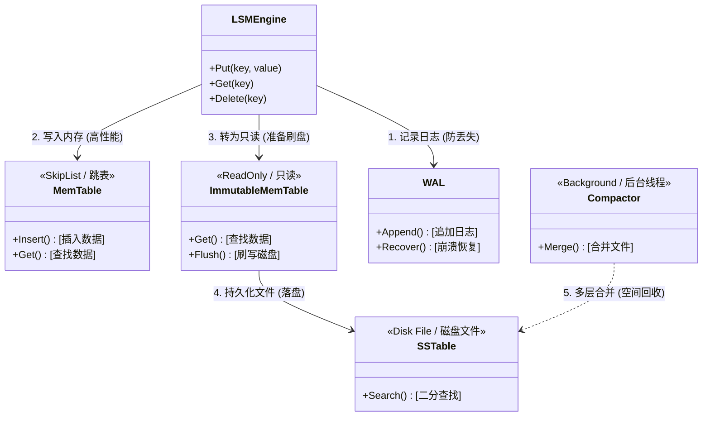
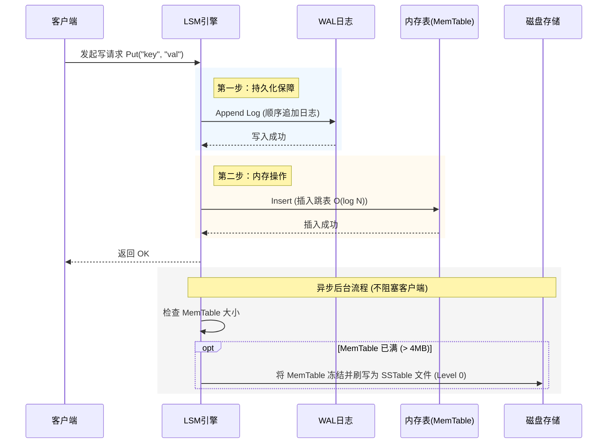
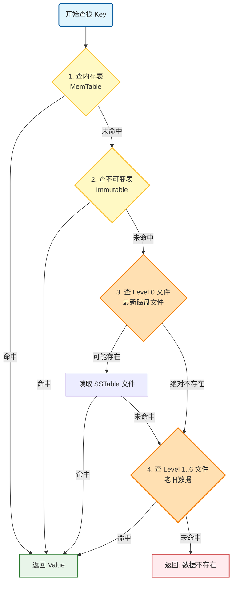
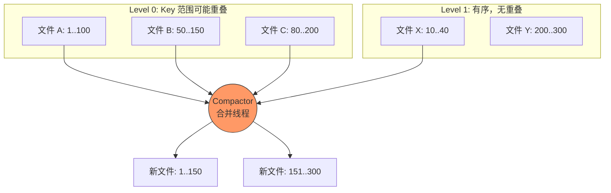

# LSM Tree 持久化存储引擎

> LevelDB/RocksDB 风格的高性能存储引擎，为 RediGo 提供持久化能力

***

## 📖 什么是 LSM Tree？

**LSM Tree (Log-Structured Merge Tree)** 是一种专为**高写入吞吐量**设计的存储结构。它的核心思想是将磁盘的**随机写**转换为**顺序写**。

你可以把它想象成一个繁忙的图书馆管理系统：

1.  **MemTable (办公桌)**: 新来的书（数据）先随手放在办公桌上。因为就在手边，处理最快。
2.  **Immutable MemTable (手推车)**: 当桌子堆满了，把这堆书打包放到手推车上。这时候这堆书只能读，不能改，准备推去仓库。
3.  **SSTable (书架)**: 仓库里的书架。书被整齐地排序、归档，查找起来很方便。
4.  **WAL (日记本)**: 为了防止断电，每次收书前先在日记本上记一笔。

***

## 🏗️ 核心架构

### 组件交互图



**组件功能详解：**

| 组件 | 中文名 | 作用 | 对应代码 |
| :--- | :--- | :--- | :--- |
| **LSMEngine** | 引擎核心 | 总指挥，协调读写请求，管理所有组件的生命周期。 | `lsm_engine.go` |
| **MemTable** | 内存表 | **活跃的**内存数据结构（跳表），支持读写。所有新数据首先写入这里。 | `memtable.go` |
| **Immutable** | 不可变表 | **只读的**内存表。当 MemTable 满时，会转换为此状态，等待后台线程刷入磁盘。 | `immutable_memtable.go` |
| **WAL** | 预写日志 | **Write-Ahead Log**。在写内存前先追加写磁盘日志，确保即使断电，数据也能恢复。 | `wal.go` |
| **SSTable** | 排序字符串表 | **Sorted String Table**。磁盘上的不可变文件，内部 Key 有序排列，支持二分查找。 | `sstable.go` |
| **Compactor** | 压缩器 | 后台清理工。负责将多个小 SSTable 合并成大文件，清理无效数据，优化读取速度。 | `compaction.go` |

***

## 🔄 数据流转详解

### 1. 写入流程 (Write Path)

LSM Tree 的写入设计是为了极致的性能，整个过程几乎不涉及随机磁盘 I/O，只有顺序追加写。



**步骤解析：**

1.  **记录日志 (WAL)**：
    *   为了防止服务器突然断电导致内存数据丢失，系统首先会将操作记录追加到 `WAL` 文件末尾。
    *   **为什么快？** 因为这是顺序写（Sequential Write），比随机写磁盘快几个数量级。
2.  **写入内存 (MemTable)**：
    *   日志记录安全后，数据被插入到内存中的 `MemTable`。
    *   `MemTable` 使用 **跳表 (SkipList)** 数据结构，插入和查找的时间复杂度都是 O(log N)，非常高效。
3.  **异步刷盘 (Flush)**：
    *   当 `MemTable` 达到阈值（默认 4MB），它会瞬间变成 `Immutable MemTable`（只读），并创建一个新的 `MemTable` 接收新写入。
    *   后台线程会将 `Immutable MemTable` 的数据排序后写成一个 `SSTable` 文件存入磁盘。这个过程是异步的，**不会阻塞**客户端的写入请求。

---

### 2. 读取流程 (Read Path)

读取时遵循 **"由新到旧"** 的查找顺序，因为越新的数据越可能在内存中。



**步骤解析：**

1.  **查热数据 (MemTable)**：
    *   首先检查内存中的 `MemTable`。如果刚写入不久，这里一定能找到，速度是纳秒级。
2.  **查次热数据 (Immutable)**：
    *   如果 `MemTable` 没找到，检查正在准备刷盘的 `Immutable MemTable`。
3.  **查磁盘数据 (SSTable)**：
    *   如果内存里都没有，就必须去磁盘找了。
    *   **Level 0**: 最新的磁盘文件。因为是直接由内存 Dump 出来的，Level 0 的不同文件之间 Key 可能会重叠，所以可能需要查多个文件。
    *   **Level 1 ~ 6**: 经过 Compaction 整理后的文件。每一层的文件之间 Key **不重叠**，可以通过二分查找快速定位。
4.  **加速黑科技**：
    *   **Bloom Filter (布隆过滤器)**：在读磁盘文件前，先问问 Bloom Filter。如果它说 "这个 Key 不在这个文件里"，那就绝对不在，**完全跳过**该文件的磁盘读取。这极大地减少了无效 I/O。
    *   **Block Cache (块缓存)**：常用的数据块会被缓存在内存中 (LRU)，再次读取时无需访问磁盘。

***

## 🔧 关键机制

### 1. Compaction (合并压缩)

随着 Level 0 文件越来越多，读取会变慢。后台线程会定期执行 Compaction。

*   **Level 0 -> Level 1**: 将 Level 0 的多个重叠文件，合并成 Level 1 的有序文件。
*   **Level N -> Level N+1**: 当某一层过大时，选出一个文件，和下一层有重叠的文件合并。



### 2. SSTable 文件格式

磁盘上的文件 (SSTable) 结构如下，包含索引和过滤器以加速查询：

```text
+-----------------+
|   Data Block 1  |  <- 存储实际 KV 数据 (按 Key 排序, Snappy 压缩)
+-----------------+
|   Data Block 2  |
+-----------------+
|       ...       |
+-----------------+
|   Filter Block  |  <- Bloom Filter 数据 (快速判断 Key 是否存在)
+-----------------+
|   Index Block   |  <- 索引 (每个 Data Block 的起始 Key 和偏移量)
+-----------------+
|      Footer     |  <- 指向 Index/Filter 的指针
+-----------------+
```

***

## 📦 文件结构

```
internal/persistence/
├── lsm_engine.go              # LSM 引擎主逻辑
├── memtable.go                # MemTable (跳表实现)
├── immutable_memtable.go      # Immutable MemTable
├── sstable.go                 # SSTable 基础定义
├── sstable_builder.go         # SSTable 构建器
├── sstable_reader.go          # SSTable 读取器
├── bloom_filter.go            # Bloom Filter
├── block_cache.go             # Block Cache (LRU)
├── table_cache.go             # Table Cache (文件描述符缓存)
├── wal.go                     # WAL 日志
├── compaction.go              # Compaction 逻辑
├── version_set.go             # Version Set 管理
├── options.go                 # 配置选项
├── iterator.go                # 迭代器接口
├── block.go                   # Block 管理
├── skiplist.go                # 跳表实现
├── utils.go                   # 工具函数
└── *_test.go                  # 单元测试文件
```

***

## 🚀 快速开始

### 1. 基本使用

```go
package main

import (
    "fmt"
    "github.com/TZJ-BYTE/RediGo/internal/persistence"
)

func main() {
    // 打开数据库
    options := persistence.DefaultOptions()
    engine, err := persistence.OpenLSMEnergy("/tmp/mydb", options)
    if err != nil {
        panic(err)
    }
    defer engine.Close()
    
    // 写入数据
    err = engine.Put([]byte("key1"), []byte("value1"))
    if err != nil {
        panic(err)
    }
    
    // 读取数据
    val, found := engine.Get([]byte("key1"))
    if found {
        fmt.Printf("Got: %s\n", string(val))
    }
    
    // 删除数据
    err = engine.Delete([]byte("key1"))
    if err != nil {
        panic(err)
    }
}
```

### 2. 编译代码

```bash
# 编译 persistence 包
cd /home/tzj/GoLang/RediGo
go build ./internal/persistence/...

# 运行所有测试
go test ./internal/persistence -v

# 运行基准测试
go test ./internal/persistence -bench=. -benchmem
```

### 3. 配置选项

```go
options := &persistence.Options{
    BlockSize:        4096,           // Block 大小
    MemTableSize:     4 << 20,        // MemTable 最大 4MB
    MaxOpenFiles:     500,            // 最大打开文件数
    BloomFPRate:      0.01,           // Bloom Filter 假阳性率
    CacheSize:        8 << 20,        // Cache 大小 8MB
    Compression:      SnappyCompression, // 启用 Snappy 压缩
}
```

***

## 🔍 故障排查

### 常见问题

#### 1. 重启后数据丢失

**症状**: 重启后无法读取之前的数据
**检查步骤**:

1. 检查数据目录 `ls -la data/db_0/sstable/`
2. 查看日志 `tail -f logs/server.log | grep -E "(LSM|SSTable|Recover)"`
3. 检查冷启动策略配置 `grep cold_start_strategy config.yml`
   **解决方案**:

- 确保 `cold_start_strategy` 不是 `no_load`
- 检查 SSTable 文件是否存在且非空
- 验证 MANIFEST 文件完整性

#### 2. 写入性能下降

**症状**: 写入速度明显变慢
**可能原因**:

- MemTable 频繁刷写
- Compaction 过于频繁
- 磁盘 I/O 瓶颈
  **优化方案**:
- 增大 `mem_table_size`
- 增大 `sstable_size`
- 调整 `level0_file_threshold`

#### 3. 内存占用过高

**症状**: 服务器内存持续增长
**检查步骤**:

- 查看 Block Cache 命中率
  **优化方案**:
- 限制 `block_cache_size`
- 使用懒加载策略 (`lazy_load`)

***

## 📊 监控指标

### 推荐监控项

1. **MemTable 大小**: `lsm_memtable_size_bytes`
2. **SSTable 数量**: `lsm_sstable_count{level}`
3. **Compaction 队列**: `lsm_compaction_queue_length`
4. **Block Cache 命中率**: `lsm_blockcache_hit_rate`
5. **WAL 文件大小**: `lsm_wal_size_bytes`
6. **写入放大系数**: `lsm_write_amplification`

### 日志关键字

```bash
# MemTable 刷写
grep "\[FLUSH\]" logs/server.log

# SSTable 创建
grep "\[SSTABLE\]" logs/server.log

# Compaction 活动
grep "\[COMPACTION\]" logs/server.log

# 恢复过程
grep -E "(Recover|LoadAllKeys)" logs/server.log
```

***

### 潜在优化方向

1. **Write Stall (写入流控)**
   - **问题**: 写入过快导致 Level 0 堆积，读性能下降
   - **改进**: 达到阈值（如 12 个文件）时主动降速，平衡读写
2. **Universal Compaction (Tiered)**
   - **问题**: Leveled 写放大较高
   - **改进**: 引入 RocksDB 风格策略，适合写多读少场景
3. **Key-Value 分离 (WiscKey)**
   - **问题**: 大 Value 搬运成本高
   - **改进**: 仅 LSM 存 Key，Value 存 Log，大幅降低写放大
4. **动态 Level 调整**
   - **问题**: 固定层级不适应动态负载
   - **改进**: 自适应调整每层大小阈值

***

## 📄 许可证

MIT License

***

## 👥 作者

TZJ-BYTE

***

*最后更新时间：2026-03-14*
